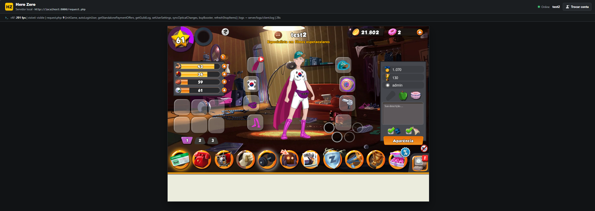

# Hero Zero — Emulated Server (Reverse Engineering)

**English** | [Português (BR)](README.pt-BR.md)

A reverse-engineering project of the game **Hero Zero** (Playata GmbH), building a
private server compatible with the official HTML5 client.

> ⚠️ For educational / private-server purposes only. The client and all game assets
> are property of Playata GmbH. Do not redistribute original assets.



## Overview

- **Game server**: Laravel (PHP 8.3) implementing the official HTTP protocol —
  `POST /request.php` with form-urlencoded actions, JSON `{ data, error }` envelope
  and `auth = md5(action + salt + user_id)` signature.
- **Actions**: ~89 client actions implemented (login, quests, duels, training,
  guilds and guild chat, events, casino, hideout, shop, boosters, leagues...).
- **Admin panel**: separate Laravel app for accounts, inventory, missions, events,
  guilds and broadcast messages.
- **Database**: MySQL 8.4 (Docker) with seed data.
- **Desktop client**: the Steam/NW.js client boots against the server via
  `steam.php` (the game itself is served from the official CDN).
- **Real-time socket**: Node.js reimplementation of the official socket
  (Engine.IO v2 / Socket.IO v2) that pushes `syncGame`/`syncGameAndGuild` events
  (e.g. guild chat) to connected clients, with graceful HTTP-polling fallback.

## Repository layout

```
HeroZero/
├── server-laravel/     # Game server (Laravel, port 8000)
│   ├── actions/        # One handler per client action (89 files)
│   └── data/           # Response fixtures captured from the real game
├── admin-laravel/      # Admin panel (Laravel, port 8001)
├── socket-server/      # Real-time socket server (Node.js, Engine.IO v2)
├── docs/
│   ├── PROTOCOL.md         # Decoded HTTP protocol (auth, login, actions)
│   ├── RESPONSE_SCHEMA.md  # 185 root response fields mapped
│   ├── SERVER_DESIGN.md    # Server architecture
│   ├── DESKTOP_CLIENT.md   # Steam/NW.js client boot
│   └── PRODUCTION_AUDIT.md # Coverage, tests, release blockers
└── tools/              # RE scripts (HAR extraction, fixture generation)
```

## Running

Requirements: PHP 8.3+, Composer, Docker (MySQL 8.4).

```bash
# Database (MySQL 8.4 on port 3308, database "herozero")
docker start herozero-db   # or create your own container and run the seed

# Game server
cd server-laravel
composer install
php artisan serve --port=8000

# Admin panel
cd admin-laravel
composer install
php artisan serve --port=8001

# Real-time socket server (optional; enables instant push, else client polls)
cd socket-server
npm install
node server.js   # listens on 127.0.0.1:8090
```

To wire the socket into the game server, set these env vars for `server-laravel`
(see `socket-server/README.md`):

```bash
HZ_SOCKET_URL=http://127.0.0.1:8090            # sent to the client as urlSocketServer
HZ_SOCKET_PUSH_URL=http://127.0.0.1:8090/push  # used by app/HeroZero/SocketPush.php
HZ_SOCKET_TOKEN=local-dev-token                # must match the socket server
```

Then open **http://127.0.0.1:8000/** in the browser (keep the tab focused — the
client preloader uses `requestAnimationFrame`, which browsers throttle in
background tabs).

Test the API directly:

```bash
curl -X POST http://127.0.0.1:8000/request.php \
  -d "action=initEnvironment&user_id=0&auth=$(php -r 'echo md5("initEnvironmentGN1al3510");')"
```

## Reverse-engineering notes

- Client is Haxe/OpenFL with class names preserved (~2,858 `com.playata.*` classes).
- Boot flow: `initEnvironment → loginUser/autoLoginUser → initGame`.
- Official game constants extracted from the CDN (`constants_json.data`, zlib),
  including the official XP curve.
- Real session traffic captured via HAR, including the socket.io handshake.
- Response schema: 185 root fields mapped in `docs/RESPONSE_SCHEMA.md`
  (89 validated against captures).

## Status

- [x] HTTP protocol fully decoded and implemented
- [x] Login, character, quests, training, duels, guilds (+ chat), events, casino, shop
- [x] Zone/story-dungeon progression with official XP curve
- [x] Admin panel
- [x] Desktop (Steam) client boot
- [x] Real-time socket server (Engine.IO v2 / Socket.IO v2) with `syncGame*` push
- [x] Response fields hardened crash-safe (present-but-null → empty container)
- [ ] Full validation of unvalidated response fields against official captures
      (shape is now crash-safe, but not yet verified against real data)
- [ ] Socket push wired into all mutating actions (guild chat done; duels, leagues,
      hideout attacks pending)
